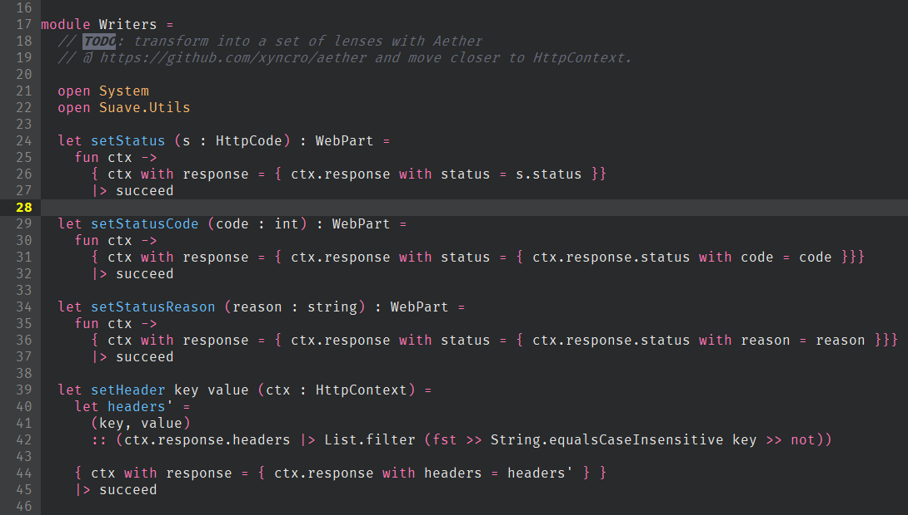

# panda-vim
[Panda](http://panda.siamak.work/) syntax colors for vim.



## Installation

Simply copy the `panda.vim` file into `~/.vim/colors/` and add this line to your `.vimrc`:

```
color panda
```
